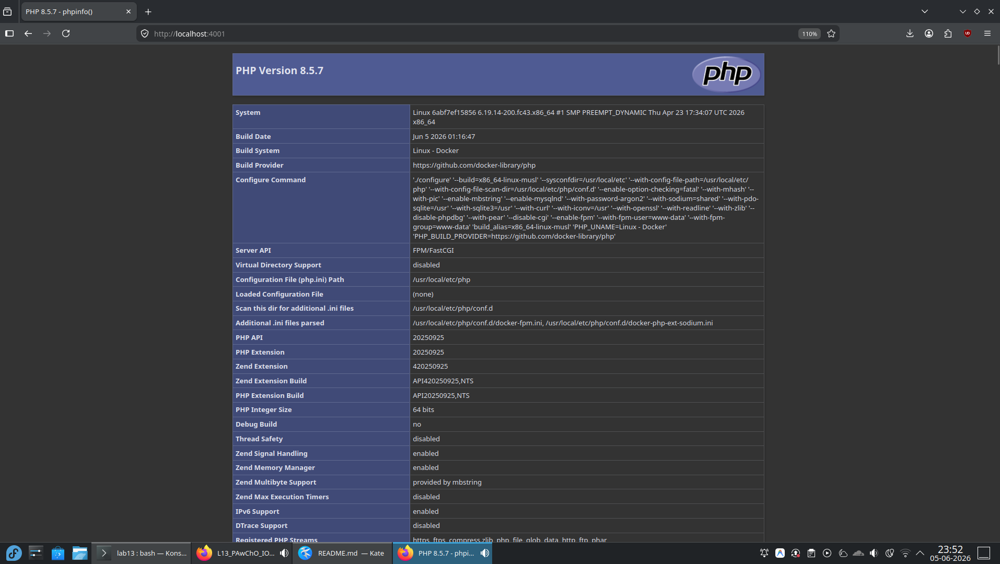
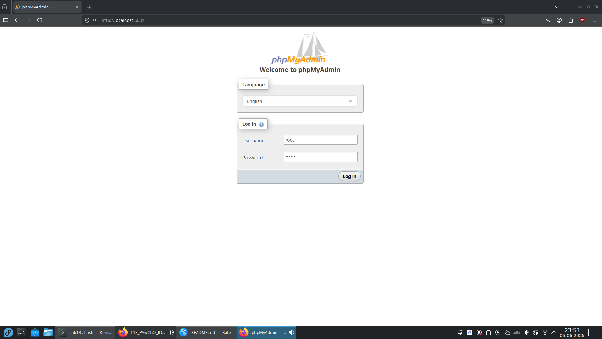
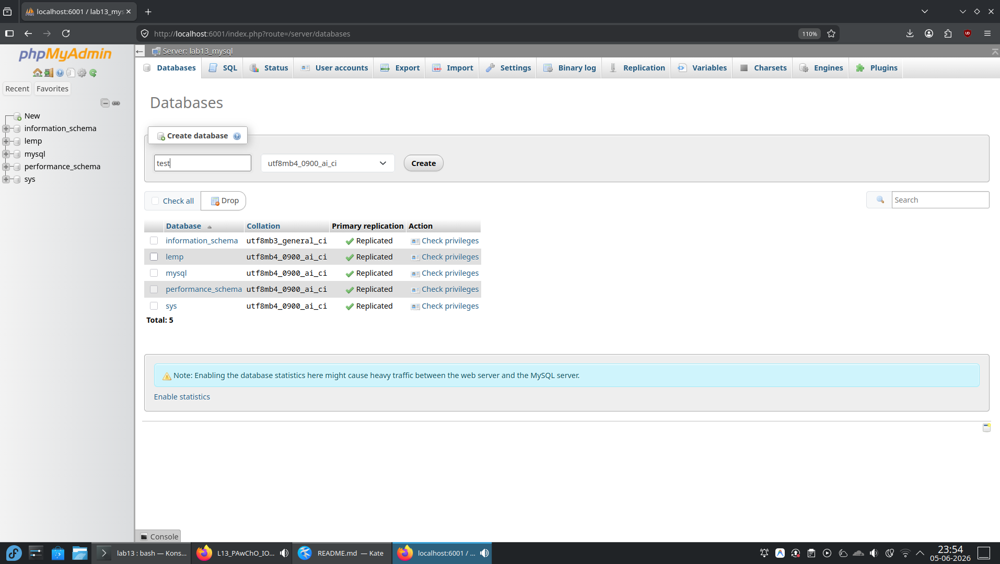
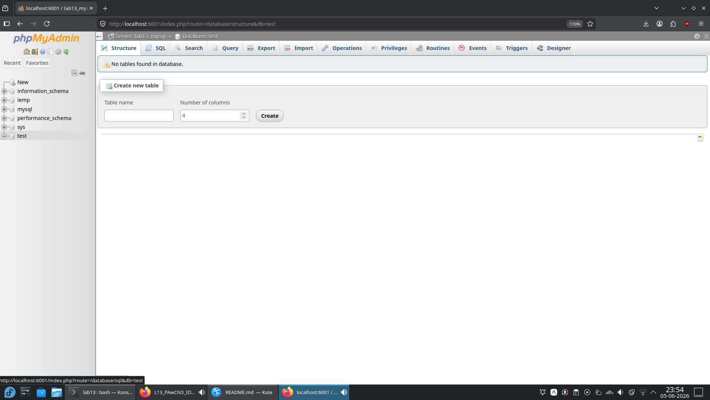
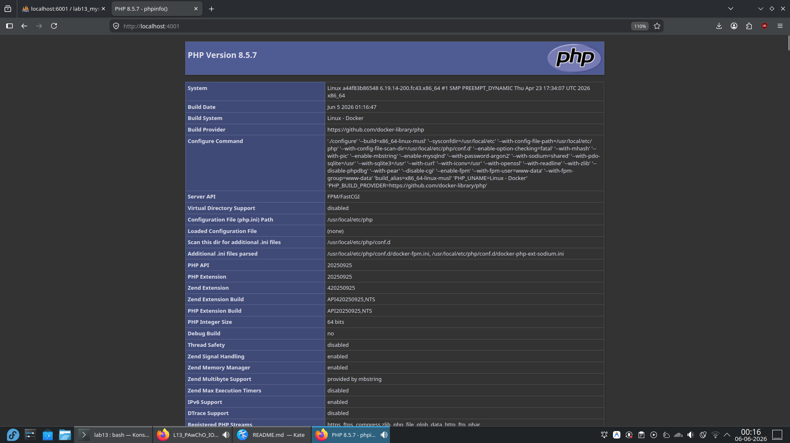
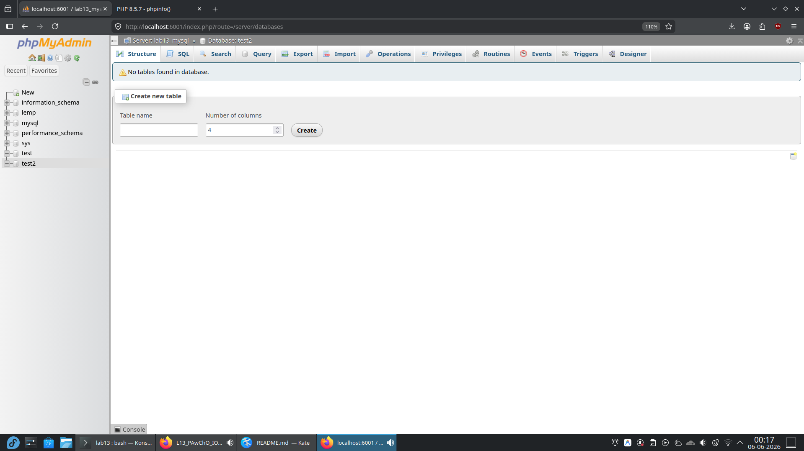

## Część obowiązkowa

Utworzono plik `docker-compose.yml`, który umożliwia uruchomienie stack-a LEMP z phpMyAdmin.

Dane wrażliwe przekazywane są poprzez zmienne środowiskowe, wartości zapisano w pliku `.env`
```
  mysql:
    environment:
      MYSQL_ROOT_PASSWORD: $DB_PASSWORD
      MYSQL_DATABASE: $DB_DATABASE
```
<br>
Przy podłączaniu wolumenów zastosowano dodatkową flagę `:z` np.
```
  php:
    volumes:
      - ./src:/var/www/html:z
```
Wynika to z konieczności dodania uprawnień na systemie Fedora. Flaga informuje system, że zawartość wolumenu ma być udostępniona procesom kontenera.


Serwer phpMyAdmin został przyłączony do sieci `backend`. Umożliwia to na komunikację z bazą danych oraz separacje topologii. Nie został podłączony do sieci `frontend` aby zapewnić dodatkową izolację od potencjalnych kontenerów frontendu.

#### Uruchomienie kontenerów
```
$ $ docker compose up -d
[+] up 6/6
 ✔ Network lab13_backend      Created                                                                           0.0s
 ✔ Network lab13_frontend     Created                                                                           0.0s
 ✔ Container lab13_php        Created                                                                           0.3s
 ✔ Container lab13_phpmyadmin Created                                                                           0.3s
 ✔ Container lab13_mysql      Created                                                                           0.3s
 ✔ Container lab13_nginx      Created   
```

#### Sprawdzanie sieci
`$ docker network inspect lab13_backend`
<details>
<summary>Wynik polecenia</summary>

```
[
    {
        "Name": "lab13_backend",
        "Id": "8a1ca646e7e834847fcd6fd23dcec47a17538ef66c90455fecc37e85ff5334db",
        "Created": "2026-06-05T23:39:05.051808697+02:00",
        "Scope": "local",
        "Driver": "bridge",
        "EnableIPv4": true,
        "EnableIPv6": false,
        "IPAM": {
            "Driver": "default",
            "Options": null,
            "Config": [
                {
                    "Subnet": "192.168.48.0/20",
                    "Gateway": "192.168.48.1"
                }
            ]
        },
        "Internal": false,
        "Attachable": false,
        "Ingress": false,
        "ConfigFrom": {
            "Network": ""
        },
        "ConfigOnly": false,
        "Options": {},
        "Labels": {
            "com.docker.compose.config-hash": "303a5c6a665d112f4cfee901befcc7bb1f43b97b72bbbccd3bbe862f5d0e35b7",
            "com.docker.compose.network": "backend",
            "com.docker.compose.project": "lab13",
            "com.docker.compose.version": "5.0.2"
        },
        "Containers": {
            "69999c1ce6c1f48bc597db6983b24a87d934b1e46e74ccb6b179ab8ea65a943b": {
                "Name": "lab13_mysql",
                "EndpointID": "13a1a621e94335e31772579bd02934c291430c655b531c7aff8f1be421980c10",
                "MacAddress": "ee:1f:b2:f5:4a:c8",
                "IPv4Address": "192.168.48.4/20",
                "IPv6Address": ""
            },
            "6abf7ef158569ee117841f313dc1eaf12677f457f9989ed771929019ac7f0b0b": {
                "Name": "lab13_php",
                "EndpointID": "b5b18a5d05a55a9c14de3e6dcbdd84ed7e79892fd6783fa1442a6ca5f18e0a18",
                "MacAddress": "72:8a:23:53:05:aa",
                "IPv4Address": "192.168.48.3/20",
                "IPv6Address": ""
            },
            "d707a1ed8b70fac621dd70e0161ea7baeca1412c6380496a1de3da04e412a959": {
                "Name": "lab13_nginx",
                "EndpointID": "198661d33fd99cc629f1c184a7fafbb09971b312976ec95857cc8891fab9c229",
                "MacAddress": "c6:be:c5:7b:6f:a8",
                "IPv4Address": "192.168.48.5/20",
                "IPv6Address": ""
            },
            "fec25925e78ed39bd0dea5c4607601d502cb796123e98211902aff80f286b483": {
                "Name": "lab13_phpmyadmin",
                "EndpointID": "8a87d806644904bb457db22ad4b06bf4411ad594866c9f54a5330492ed1e2ec0",
                "MacAddress": "ee:ff:48:32:b5:4f",
                "IPv4Address": "192.168.48.2/20",
                "IPv6Address": ""
            }
        },
        "Status": {
            "IPAM": {
                "Subnets": {
                    "192.168.48.0/20": {
                        "IPsInUse": 7,
                        "DynamicIPsAvailable": 4089
                    }
                }
            }
        }
    }
]
```

</details>

`$ docker network inspect lab13_frontend`
<details>
<summary>Wynik polecenia</summary>

```
[
    {
        "Name": "lab13_frontend",
        "Id": "5a40a7e5cfc1c38020c66dec1c29364ebd44f34e64e61c7a53454864ff284fd4",
        "Created": "2026-06-05T23:39:05.101704344+02:00",
        "Scope": "local",
        "Driver": "bridge",
        "EnableIPv4": true,
        "EnableIPv6": false,
        "IPAM": {
            "Driver": "default",
            "Options": null,
            "Config": [
                {
                    "Subnet": "192.168.64.0/20",
                    "Gateway": "192.168.64.1"
                }
            ]
        },
        "Internal": false,
        "Attachable": false,
        "Ingress": false,
        "ConfigFrom": {
            "Network": ""
        },
        "ConfigOnly": false,
        "Options": {},
        "Labels": {
            "com.docker.compose.config-hash": "c99dfed360a6944db43f183a5bd3f4016b0c10584adeeaa2e535a0bc34386287",
            "com.docker.compose.network": "frontend",
            "com.docker.compose.project": "lab13",
            "com.docker.compose.version": "5.0.2"
        },
        "Containers": {
            "d707a1ed8b70fac621dd70e0161ea7baeca1412c6380496a1de3da04e412a959": {
                "Name": "lab13_nginx",
                "EndpointID": "a3a6458d516d86ea4b820a6af226c87c275d470f0888d59ea32a10cd1e3f4388",
                "MacAddress": "ca:7b:6a:74:55:0a",
                "IPv4Address": "192.168.64.2/20",
                "IPv6Address": ""
            }
        },
        "Status": {
            "IPAM": {
                "Subnets": {
                    "192.168.64.0/20": {
                        "IPsInUse": 4,
                        "DynamicIPsAvailable": 4092
                    }
                }
            }
        }
    }
]
```

</details>

#### Sprawdzenie działania

- Strona PHP




- Dodanie bazy w phpMyAdmin







#### Wyłączono kontenery
```
$ docker compose down
[+] down 6/6
 ✔ Container lab13_mysql      Removed                                                                           1.6s
 ✔ Container lab13_phpmyadmin Removed                                                                           1.6s
 ✔ Container lab13_nginx      Removed                                                                           1.4s
 ✔ Container lab13_php        Removed                                                                           0.3s
 ✔ Network lab13_frontend     Removed                                                                           0.2s
 ✔ Network lab13_backend      Removed  
 ```

## Część nieobowiązkowa

Utworzono plik `docker-compose-nieob.yml`, aby zastosować secrety do przekazywania wrażliwych danych.

Do sekcji `mysql` dodano plików z wartościami, oraz element `secrets`
```
  mysql:
    container_name: lab13_mysql
    image: mysql:8.4.9
    networks:
      - backend
    environment:
      MYSQL_ROOT_PASSWORD_FILE: /run/secrets/db_root_password
      MYSQL_DATABASE_FILE: /run/secrets/db_database
    volumes:
      - mysql_data:/var/lib/mysql
    secrets:
      - db_root_password
      - db_database
```

Utworzono sekcję `secrets` w której zdefiniowano ścieżki do odpowiednich plików.
```
secrets:
  db_root_password:
    file: secrets/db_root_password
  db_database:
    file: secrets/db_database
```

#### Uruchomienie kontenerów
```
$ docker compose -f docker-compose-nieob.yml up -d
[+] up 6/6
 ✔ Network lab13_backend      Created                                                                           0.0s
 ✔ Network lab13_frontend     Created                                                                           0.0s
 ✔ Container lab13_phpmyadmin Created                                                                           0.2s
 ✔ Container lab13_php        Created                                                                           0.2s
 ✔ Container lab13_mysql      Created                                                                           0.2s
 ✔ Container lab13_nginx      Created                                                                           0.1s
 ```
 
#### Sprawdzenie działania

- Strona PHP




- Dodanie bazy w phpMyAdmin




#### Wyłączono kontenery
```
$ docker compose down
[+] down 6/6
 ✔ Container lab13_mysql      Removed                                                                           0.9s
 ✔ Container lab13_nginx      Removed                                                                           0.4s
 ✔ Container lab13_phpmyadmin Removed                                                                           1.3s
 ✔ Container lab13_php        Removed                                                                           0.2s
 ✔ Network lab13_frontend     Removed                                                                           0.1s
 ✔ Network lab13_backend      Removed                                                                           0.2s
```
