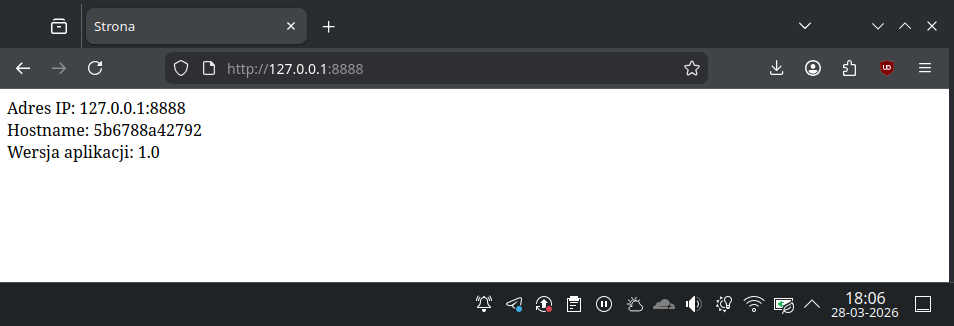

### Lab 5

Obraz budowany jest na podstawie pliku `Dockerfile`, który znajduje się w obecnym katalogu.

#### Budowa obrazu:
```
sk@fedora:~/studia/chmura/git_repo/lab5$ docker build --build-arg VERSION=1.0 -t local/lab5:v1 .
[+] Building 1.2s (10/10) FINISHED                                                                   docker:default
 => [internal] load build definition from Dockerfile                                                           0.0s
 => => transferring dockerfile: 1.32kB                                                                         0.0s
 => [internal] load metadata for docker.io/library/nginx:1.28-alpine                                           0.7s
 => [internal] load .dockerignore                                                                              0.0s
 => => transferring context: 2B                                                                                0.0s
 => [internal] load build context                                                                              0.0s
 => => transferring context: 118B                                                                              0.0s
 => [stage-1 1/2] FROM docker.io/library/nginx:1.28-alpine@sha256:a8b39bd9cf0f83869a2162827a0caf6137ddf759d50  0.1s
 => => resolve docker.io/library/nginx:1.28-alpine@sha256:a8b39bd9cf0f83869a2162827a0caf6137ddf759d50a171451b  0.1s
 => [internal] preparing inline document                                                                       0.0s
 => CACHED [build 1/2] ADD alpine-minirootfs-3.23.3-x86_64.tar /                                               0.0s
 => CACHED [build 2/2] COPY <<EOF /src/index.html.template                                                     0.0s
 => CACHED [stage-1 2/2] COPY --from=build /src/ /etc/nginx/templates/                                         0.0s
 => exporting to image                                                                                         0.2s
 => => exporting layers                                                                                        0.0s
 => => exporting manifest sha256:89f0444621f0fe503fde3b95a0b18d416469cc022638838371d39a6d459142be              0.0s
 => => exporting config sha256:6899be6e21d6c5dd3f5f5ea75a7fdbfd226d5f0e5cce0a07223ce95b1cc3e27f                0.0s
 => => exporting attestation manifest sha256:96a6e097d7f44236223c11e11c60a1a9e86f21e996d98e0a758fd15770c0a013  0.0s
 => => exporting manifest list sha256:c317c0e28518b62bc970806071b67888b26a63cad6cc6abc9b79fd1fc879baa2         0.0s
 => => naming to docker.io/local/lab5:v1                                                                       0.0s
 => => unpacking to docker.io/local/lab5:v1                                                                    0.0s

View build details: docker-desktop://dashboard/build/default/default/vzbw92snok3qqyjm9sr93bccr
```

#### Polecenie uruchamiające serwer na porcie 8888, pod nazwą lab5
`docker run --name lab5 -d -p 8888:80 local/lab5:v1`

#### Polecenie potwierdzające działanie kontenera i poprawne funkcjonowanie aplikacji (status healthy)
```
sk@fedora:~/studia/chmura/git_repo/lab5$ docker ps 
CONTAINER ID   IMAGE                                       COMMAND                  CREATED          STATUS                    PORTS                                                                             NAMES
5b6788a42792   local/lab5:v1                               "/docker-entrypoint.…"   42 seconds ago   Up 41 seconds (healthy)   0.0.0.0:8888->80/tcp, [::]:8888->80/tcp                                           lab5
```

#### Widok w przeglądarce

