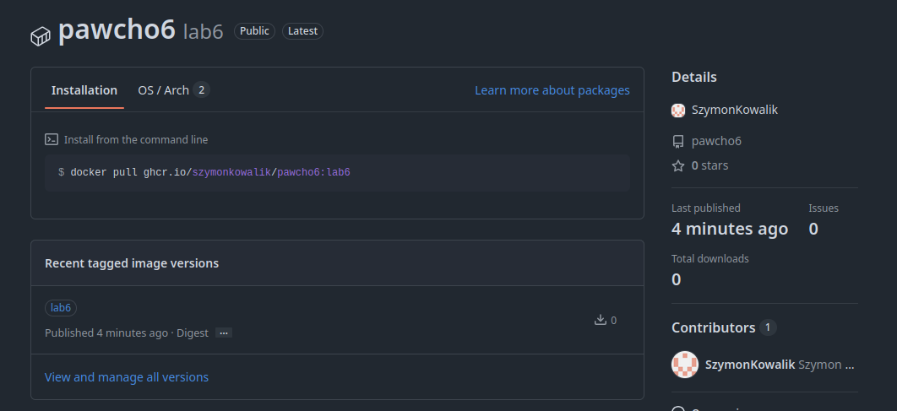

### Lab 6

#### Tworzenie repozytorium
```
sk@fedora:~/studia/chmura/zad/lab5$ git init
Initialized empty Git repository in /home/sk/studia/chmura/zad/lab5/.git/
sk@fedora:~/studia/chmura/zad/lab5$ git add .
sk@fedora:~/studia/chmura/zad/lab5$ git commit -m "Initial commit"
[main (root-commit) 26f5703] Initial commit
 2 files changed, 46 insertions(+)
 create mode 100644 Dockerfile
 create mode 100755 alpine-minirootfs-3.23.3-x86_64.tar
sk@fedora:~/studia/chmura/zad/lab5$ gh repo create pawcho6 --public --source=. --remote=origin --push
✓ Created repository SzymonKowalik/pawcho6 on github.com
  https://github.com/SzymonKowalik/pawcho6
✓ Added remote git@github.com:SzymonKowalik/pawcho6.git
Enumerating objects: 4, done.
Counting objects: 100% (4/4), done.
Delta compression using up to 12 threads
Compressing objects: 100% (4/4), done.
Writing objects: 100% (4/4), 3.66 MiB | 1.67 MiB/s, done.
Total 4 (delta 0), reused 0 (delta 0), pack-reused 0 (from 0)
To github.com:SzymonKowalik/pawcho6.git
 * [new branch]      HEAD -> main
branch 'main' set up to track 'origin/main'.
✓ Pushed commits to git@github.com:SzymonKowalik/pawcho6.git
```
[Link do repozytorium](https://github.com/SzymonKowalik/pawcho6)


#### Modyfikacja pliku Dockerfile
W pierwszej linii pliku dodano instrukcję, która sprawia że plik pełni rolę frontendu dla silnika Buildkit. Następnie utworzono etab budowy, niezbędny do klonowania plików z serwera github.
```
# syntax=docker/dockerfile:1

# etap 0
FROM alpine:3.23 AS cloner

# Instalacja wymaganych programów
RUN apk add --no-cache git openssh-client

# Dodanie github do zaufanych hostów
RUN mkdir -p -m 0700 ~/.ssh && ssh-keyscan github.com >> ~/.ssh/known_hosts

# Pobranie repozytorium za pomocą SSH
RUN --mount=type=ssh git clone git@github.com:SzymonKowalik/pawcho6.git /repo
```
Jako źródło obrazu w etapie 1, wykorzystano obraz pobrany na etapie 0
```
FROM scratch AS build

COPY --from=cloner /repo/alpine-minirootfs-3.23.3-x86_64.tar /
```

#### Budowanie obrazu oraz przesłanie na repozytorium Github
W procesie budowania nadano obrazowi nazwę lab6
```
sk@fedora:~/studia/chmura/zad/lab5$ docker build --ssh default -t lab6 .
```
Zalogowano do repozytorium ghcr
```
sk@fedora:~/studia/chmura/zad/lab5$ cat ~/.ssh/gh_pat | docker login ghcr.io -u SzymonKowalik --password-stdin
Login Succeeded
```
Przesłano obraz do repozytorium
```
sk@fedora:~/studia/chmura/zad/lab5$ docker tag lab6 ghcr.io/szymonkowalik/pawcho6:lab6
sk@fedora:~/studia/chmura/zad/lab5$ docker push ghcr.io/szymonkowalik/pawcho6:lab6 
The push refers to repository [ghcr.io/szymonkowalik/pawcho6]
8f7c784e2471: Pushed 
98104829f3fe: Pushed 
589002ba0eae: Pushed 
0151c82f84a9: Pushed 
4306546a0571: Pushed 
1d9cbdb003be: Pushed 
e914c6e98e37: Pushed 
26bbab082a7c: Pushed 
d631a49fb4f7: Pushed 
44fa0a5a779f: Pushed 
lab6: digest: sha256:d5ecd141cec1bd316fc0f00da4cbc1145e04535ba6389b50a4e84eecc3c8f875 size: 856
```
#### Widok na stronie github
Zmieniono obraz na publiczny oraz powiązano z repozytorium `pawcho6`


[Link do obrazu](https://github.com/SzymonKowalik/pawcho6/pkgs/container/pawcho6)
