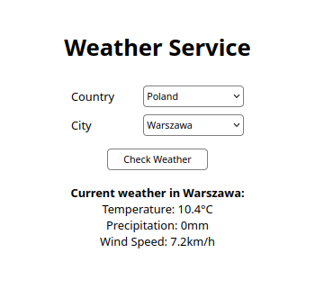

### Zadanie 1 - Nieobowiązkowe

Obraz budowany jest na podstawie pliku `Dockerfile` oraz kodu źródłowego zawartego w repozytorium github.

Przy uruchamianiu kontenera można podać opcjonalne zmienne środowiskowe dla aplikacji:
 - `TZ` - strefa czasowa do wyświetlania logów np. `CET-1CEST,M3.5.0,M10.5.0/3`
 - `DISPLAY_PORT` - port wyświetlany w logach, aby wyświetlać port zewnętrzny a nie nasłuchujący w kontenerze 8000

#### Tworzenie buildera
`docker buildx create --name mybuilder --driver docker-container --use --bootstrap`

#### Sprawdzanie parametrów buildera
```
$ docker buildx inspect
Name:          mybuilder
Driver:        docker-container
Last Activity: 2026-05-09 18:44:27 +0000 UTC

Nodes:
Name:                  mybuilder0
Endpoint:              unix:///var/run/docker.sock
Status:                running
BuildKit daemon flags: --allow-insecure-entitlement=network.host
BuildKit version:      v0.29.0
Platforms:             linux/amd64, linux/amd64/v2, linux/amd64/v3, linux/arm64, linux/riscv64, linux/ppc64le, linux/s390x, linux/386, linux/mips64le, linux/mips64, linux/loong64, linux/arm/v7, linux/arm/v6
Labels:
 org.mobyproject.buildkit.worker.executor:         oci
 org.mobyproject.buildkit.worker.hostname:         742a48fe13e9
 org.mobyproject.buildkit.worker.network:          host
 org.mobyproject.buildkit.worker.oci.process-mode: sandbox
 org.mobyproject.buildkit.worker.selinux.enabled:  false
 org.mobyproject.buildkit.worker.snapshotter:      overlayfs
```

#### Budowanie obrazu
Obraz budowany jest za pomocą utworzonego buildera na platformy linux/amd64 i linux/arm64. Wykorzystuje domyślny klucz ssh do pobrania kodu aplikacji z repozytorium github oraz cache umieszczony na repozytorium dockerhub.

```
$ docker buildx build \
  --builder mybuilder \
  --platform linux/amd64,linux/arm64 \
  --ssh default \
  --cache-from type=registry,ref=szymonk44/laby:zadanie1-nieob-cache \
  --cache-to type=registry,ref=szymonk44/laby:zadanie1-nieob-cache,mode=max \
  -t szymonk44/laby:zadanie1-nieob \
  --push \
  .
[+] Building 111.5s (28/28) FINISHED                                                     docker-container:mybuilder
 => [internal] load build definition from Dockerfile                                                           0.0s
 => => transferring dockerfile: 1.53kB                                                                         0.0s
 => resolve image config for docker-image://docker.io/docker/dockerfile:1                                      0.7s
 => CACHED docker-image://docker.io/docker/dockerfile:1@sha256:2780b5c3bab67f1f76c781860de469442999ed1a0d7992  0.0s
 => => resolve docker.io/docker/dockerfile:1@sha256:2780b5c3bab67f1f76c781860de469442999ed1a0d7992a5efdf2cffc  0.0s
 => [linux/amd64 internal] load metadata for docker.io/library/alpine:3.22.4                                   0.3s
 => [linux/arm64 internal] load metadata for docker.io/library/alpine:3.22.4                                   0.5s
 => [internal] load .dockerignore                                                                              0.0s
 => => transferring context: 2B                                                                                0.0s
 => ERROR importing cache manifest from szymonk44/laby:zadanie1-nieob-cache                                    1.9s
 => CACHED [linux/amd64 stage-1 1/3] WORKDIR /app                                                              0.0s
 => [linux/amd64 builder 1/6] FROM docker.io/library/alpine:3.22.4@sha256:310c62b5e7ca5b08167e4384c68db0fd290  0.0s
 => => resolve docker.io/library/alpine:3.22.4@sha256:310c62b5e7ca5b08167e4384c68db0fd2905dd9c7493756d356e893  0.0s
 => [linux/arm64 builder 1/6] FROM docker.io/library/alpine:3.22.4@sha256:310c62b5e7ca5b08167e4384c68db0fd290  0.1s
 => => resolve docker.io/library/alpine:3.22.4@sha256:310c62b5e7ca5b08167e4384c68db0fd2905dd9c7493756d356e893  0.1s
 => CACHED [linux/amd64 builder 2/6] RUN apk add --no-cache g++ cmake make upx git openssh-client              0.0s
 => CACHED [linux/amd64 builder 3/6] RUN mkdir -p -m 0700 ~/.ssh && ssh-keyscan github.com >> ~/.ssh/known_ho  0.0s
 => CACHED [linux/amd64 builder 4/6] WORKDIR /app                                                              0.0s
 => [linux/amd64 builder 5/6] RUN --mount=type=ssh git clone git@github.com:SzymonKowalik/pawcho_zadanie1_kod  2.5s
 => CACHED [linux/arm64 builder 2/6] RUN apk add --no-cache g++ cmake make upx git openssh-client              0.0s
 => CACHED [linux/arm64 builder 3/6] RUN mkdir -p -m 0700 ~/.ssh && ssh-keyscan github.com >> ~/.ssh/known_ho  0.0s
 => CACHED [linux/arm64 builder 4/6] WORKDIR /app                                                              0.0s
 => [linux/arm64 builder 5/6] RUN --mount=type=ssh git clone git@github.com:SzymonKowalik/pawcho_zadanie1_kod  3.8s
 => [linux/amd64 builder 6/6] RUN mkdir build && cd build &&     cmake -DCMAKE_BUILD_TYPE=MinSizeRel     -DCM  5.6s
 => [linux/arm64 builder 6/6] RUN mkdir build && cd build &&     cmake -DCMAKE_BUILD_TYPE=MinSizeRel     -DC  46.7s 
 => [linux/amd64 stage-1 2/3] COPY --from=builder /app/build/weatherApp /app/server                            0.1s
 => [linux/amd64 stage-1 3/3] COPY --from=builder /app/static /app/static                                      0.1s
 => [linux/arm64 stage-1 2/3] COPY --from=builder /app/build/weatherApp /app/server                            0.1s
 => [linux/arm64 stage-1 3/3] COPY --from=builder /app/static /app/static                                      0.1s 
 => exporting to image                                                                                         9.7s 
 => => exporting layers                                                                                        0.6s 
 => => exporting manifest sha256:cdc9903259896267a3eeaff03a6110b6fbcb491d76388b2893712f4ccd6abe8b              0.0s 
 => => exporting config sha256:2faa021e68c82bc271566f19c3a949e377b4569788af8c33a9003c5cb84354cc                0.0s 
 => => exporting attestation manifest sha256:ba1c5a1b91d34f6d4de9699527e7afc1b91eb647f7f6dbad08fd1a387e909397  0.1s
 => => exporting manifest sha256:f01606e42236f7489513359c7c53e1dfc8aa0dd4c5b8c1d81dd2425c236852ec              0.0s
 => => exporting config sha256:ca5bdb3aab2336b99626cf6dd8504e8f30116bc46755a996d9f3222b424e53f1                0.0s
 => => exporting attestation manifest sha256:3570be83f1741bf20cefb06c5aa6031b442ca0a55eb514d294315abad48937ad  0.1s
 => => exporting manifest list sha256:338d4a5be544a314c8874daa7c0b25c4e1edbf3a7bfda9de746eedfd86a1f4f9         0.0s
 => => pushing layers                                                                                          3.9s
 => => pushing manifest for docker.io/szymonk44/laby:zadanie1-nieob@sha256:338d4a5be544a314c8874daa7c0b25c4e1  4.9s
 => exporting cache to registry                                                                               56.3s
 => => preparing build cache for export                                                                       29.1s
 => => sending cache export                                                                                   27.2s
 => => writing layer sha256:1bef49a3aeb2a458f049848872b74ef652678264d067f6aa32f9120fa7f79e2c                   1.1s
 => => writing layer sha256:187aae285baba5e1866f526b98b93b9e3834d7abad03d36f80df2b76ac059cb5                   1.1s
 => => writing layer sha256:11798e88b02401ebc7984381f01e757292d0649938ea40cfe9ff4d80c5a6aa42                   2.0s
 => => writing layer sha256:0e44ad059113b5df4183d71f3bdf8ee83e286418df9dcf8e7588f60f6daf8d7c                   2.7s
 => => writing layer sha256:2fff83a46c39cf00daacf1c0c84833203a5261bd3b38c273251ae71faf0746c0                  15.4s
 => => writing layer sha256:1d9aca6bb8d753d5cbea4854a30b425bb9ce2a9c7ad027bdcc353207f3aea574                   1.4s
 => => writing layer sha256:3f5b1bb30ecc8cd8c1709311dddea2d6e9719566e485558d04b010e6e17aa69b                   0.5s
 => => writing layer sha256:58e777220c395c319866c5d73ea32a5ea574bbd12f4eb289b392f584d0cd953e                   3.0s
 => => writing layer sha256:5ce6b8f228cdc8e15f1479223de0a4dd9aed968d4cbb9efe0be4b62fb668f833                  21.1s
 => => writing layer sha256:5e7ca4171301aff5b94ab9a9317395492c7cd16c792d2724f7286ea101f264db                   1.3s
 => => writing layer sha256:6962463ad6a1e112ace395b13697b94a8c21269d2e6bffd3b489a876d93ae079                   0.1s
 => => writing layer sha256:71c9741ed896d5777bbf8147fa34da86934a947bf1b46ea6adb9dcec92618421                   2.3s
 => => writing layer sha256:84f5eff04246b56d48d1ed6cbd82d6bc7e53f7e790db6a467f92571c69f3289e                   2.5s
 => => writing layer sha256:c71f1092aaf1ff517172421b7f2be3a07c0d9f1b0420f3fae174748555e4c888                   0.2s
 => => writing layer sha256:e24e55594a17644fdd96d817cc3ac606631ae32ce048a2020741885848703a08                   0.2s
 => => writing layer sha256:f41ad549644e7c89e1337a32eaf564fee4836c17a40341f1c9adbb340b674255                   1.1s
 => => writing config sha256:74fe38e9de6f4483cb9678824648575e3a52c228a1129636a49d4144602a93f4                  1.1s
 => => writing cache image manifest sha256:76dfe073f3f75c165fde496ab6a6915c602a74c1318b539369e0b3bbbfc5e8d6    2.0s
 => [auth] szymonk44/laby:pull,push token for registry-1.docker.io                                             0.0s
 => [auth] szymonk44/laby:pull,push token for registry-1.docker.io                                             0.0s
------
 > importing cache manifest from szymonk44/laby:zadanie1-nieob-cache:
------
```

#### Weryfikacja platform
Manifest zawiera platformy `linux/amd64` oraz `linux/arm64`
```
$ docker buildx imagetools inspect szymonk44/laby:zadanie1-nieob
Name:      docker.io/szymonk44/laby:zadanie1-nieob
MediaType: application/vnd.oci.image.index.v1+json
Digest:    sha256:338d4a5be544a314c8874daa7c0b25c4e1edbf3a7bfda9de746eedfd86a1f4f9
           
Manifests: 
  Name:        docker.io/szymonk44/laby:zadanie1-nieob@sha256:cdc9903259896267a3eeaff03a6110b6fbcb491d76388b2893712f4ccd6abe8b
  MediaType:   application/vnd.oci.image.manifest.v1+json
  Platform:    linux/amd64
               
  Name:        docker.io/szymonk44/laby:zadanie1-nieob@sha256:f01606e42236f7489513359c7c53e1dfc8aa0dd4c5b8c1d81dd2425c236852ec
  MediaType:   application/vnd.oci.image.manifest.v1+json
  Platform:    linux/arm64
  ...
```

#### Weryfikacja cache
Przy ponownej budowie obrazu widać fragment wskazujący na wykorzystanie cache z repozytorium.
```
=> importing cache manifest from szymonk44/laby:zadanie1-nieob-cache                                          1.4s
 => => inferred cache manifest type: application/vnd.oci.image.manifest.v1+json                                0.0s
 => [auth] szymonk44/laby:pull token for registry-1.docker.io                                                  0.0s
 => [linux/arm64 builder 1/6] FROM docker.io/library/alpine:3.22.4@sha256:310c62b5e7ca5b08167e4384c68db0fd290  0.0s
 => => resolve docker.io/library/alpine:3.22.4@sha256:310c62b5e7ca5b08167e4384c68db0fd2905dd9c7493756d356e893  0.0s
 => [linux/arm64 stage-1 1/3] WORKDIR /app                                                                     0.0s
 => [linux/amd64 builder 1/6] FROM docker.io/library/alpine:3.22.4@sha256:310c62b5e7ca5b08167e4384c68db0fd290  0.0s
 => => resolve docker.io/library/alpine:3.22.4@sha256:310c62b5e7ca5b08167e4384c68db0fd2905dd9c7493756d356e893  0.0s
 => CACHED [linux/arm64 builder 2/6] RUN apk add --no-cache g++ cmake make upx git openssh-client              0.0s
 => CACHED [linux/arm64 builder 3/6] RUN mkdir -p -m 0700 ~/.ssh && ssh-keyscan github.com >> ~/.ssh/known_ho  0.0s
 => CACHED [linux/arm64 builder 4/6] WORKDIR /app                                                              0.0s
 => CACHED [linux/arm64 builder 5/6] RUN --mount=type=ssh git clone git@github.com:SzymonKowalik/pawcho_zadan  0.0s
 => CACHED [linux/arm64 builder 6/6] RUN mkdir build && cd build &&     cmake -DCMAKE_BUILD_TYPE=MinSizeRel    0.0s
 => CACHED [linux/arm64 stage-1 2/3] COPY --from=builder /app/build/weatherApp /app/server                     0.0s
 => CACHED [linux/arm64 stage-1 3/3] COPY --from=builder /app/static /app/static                               0.0s
 => CACHED [linux/amd64 builder 2/6] RUN apk add --no-cache g++ cmake make upx git openssh-client              0.0s
 => CACHED [linux/amd64 builder 3/6] RUN mkdir -p -m 0700 ~/.ssh && ssh-keyscan github.com >> ~/.ssh/known_ho  0.0s
 => CACHED [linux/amd64 builder 4/6] WORKDIR /app                                                              0.0s
 => CACHED [linux/amd64 builder 5/6] RUN --mount=type=ssh git clone git@github.com:SzymonKowalik/pawcho_zadan  0.0s
 => CACHED [linux/amd64 builder 6/6] RUN mkdir build && cd build &&     cmake -DCMAKE_BUILD_TYPE=MinSizeRel    0.0s
 => CACHED [linux/amd64 stage-1 2/3] COPY --from=builder /app/build/weatherApp /app/server                     0.0s
 => CACHED [linux/amd64 stage-1 3/3] COPY --from=builder /app/static /app/static                               0.0s
 => exporting to image                                                                   
```

#### Analiza podatności na zagrożenia
Wykorzystane narzędzie Docker Scout nie znalazło żadnych podatności. Poziom bezpieczeństwa został osiągnięty dzięki zastosowaniu wieloetapowego budowania oraz wykorzystania obrazu `scratch`.
```
$ docker scout cves szymonk44/laby:zadanie1-nieob
    ✓ Pulled
    ✓ Image stored for indexing
    ✓ Indexed 0 packages
    ✓ Provenance obtained from attestation
    ✓ No vulnerable package detected


## Overview

                   │         Analyzed Image          
───────────────────┼─────────────────────────────────
 Target            │  szymonk44/laby:zadanie1-nieob  
   digest          │  cdc990325989                   
   platform        │ linux/amd64                     
   vulnerabilities │    0C     0H     0M     0L      
   size            │ 45 kB                           
   packages        │ 0                               


## Packages and Vulnerabilities

  No vulnerable packages detected
```

#### Uruchamianie kontenera i testowanie działania
```
$ docker run --rm -p 8001:8000 -e DISPLAY_PORT=8001 --name zadanie1_nieob szymonk44/laby:zadanie1-nieob
136f55 3 mongoose.c:6335:mg_mgr_init    MG_IO_SIZE: 16384, TLS: none
[2026-05-09 20:20:17] Start time: 2026-05-09 20:20:17
[2026-05-09 20:20:17] Server started on outside port 8001
[2026-05-09 20:20:17] Author: Szymon Kowalik
136f55 3 mongoose.c:6252:mg_listen      1 4 http://0.0.0.0:8000
1387a0 3 mongoose.c:12577:accept_conn   2 5 accepted 192.168.65.1:57695 -> 172.17.0.2:8000
1387a1 3 mongoose.c:12427:read_conn     2 5 0:0:0 558 err 0
[2026-05-09 20:20:23] GET /
1387a1 3 mongoose.c:12438:write_conn    2 5 snd 58/16384 rcv 0/16384 n=58 err=0
13883e 3 mongoose.c:12427:read_conn     2 5 0:0:0 490 err 0
[2026-05-09 20:20:23] GET /api/locations

```



[Repozytorium Docker Hub](https://hub.docker.com/r/szymonk44/laby/tags)

[Repozytorium GitHub z kodem](https://github.com/SzymonKowalik/pawcho_zadanie1_kod)
